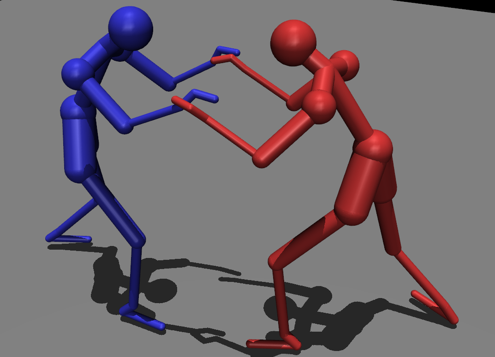

# BJJ Physics Humanoid

This project provides a physics-based humanoid model for simulating Brazilian Jiu Jitsu (BJJ) positions and transitions in [MuJoCo](https://mujoco.readthedocs.io/). It allows loading positions from the [GrappleMap](https://github.com/Eelis/GrappleMap) dataset, visualizing two players, and generating MuJoCo scenes with realistic mass, joint limits, and actuators.




**Key Features:**
- Converts GrappleMap positions (JSON) into MuJoCo XML (MJCF) for both players.
- Realistic skeleton hierarchy with appropriate joints, masses, and actuators.
- Ground plane, lighting, and easy CLI for loading and visualizing positions.

## Quick Start

```bash
# Visualize a GrappleMap position (e.g., pos_61) as two physics-based humanoids
python bjj_physics_humanoid.py pos_61 --scale=0.3
 
# View only player 1 or 2 (useful for debugging)
python bjj_physics_humanoid.py pos_61 --player=1 --scale=0.3
```

# Credits

- [GrappleMap](https://github.com/Eelis/GrappleMap): Original BJJ position data.
- [JuiJitsu-RL](https://github.com/amorsi1/JuiJitsu-RL): Parser and example code inspiration.